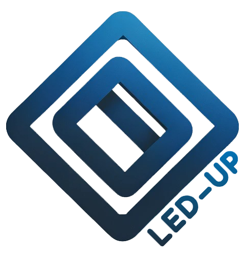

<h1 align="center" style="display:flex; flex-direction: column; gap: 10px; align-items:center;">
  
   LED-UP General Overview  
</h1>
 

Welcome to LED-UP code repository, where we are building a decentralized data management platform. The project consists of smart contracts, serverless APIs, and comprehensive documentation.

## About LED-UP

LED-UP platform revolutionizing data sharing and compensation systems. Our platform empowers individuals and organizations to manage their data in a secure, efficient, and transparent manner. We provide tools that allow data providers to register, share, and control access to their information, all while ensuring data integrity and trust through our smart contracts and serverless APIs.

### Key Components

1. **Decentralized Data Management**: Our smart contracts enable users to securely register and share data, ensuring that only authorized parties can access it.

2. **Compensation System**: LED-UP incorporates a unique compensation model that ensures data providers receive fair payment for their contributions, incentivizing data sharing.

3. **Serverless APIs**: Built using Azure Functions, our APIs provide scalable and efficient means of interacting with the LED-UP platform, facilitating data uploads, sharing, and retrieval operations.

4. **Comprehensive Documentation**: We offer extensive documentation to guide developers in effectively utilizing our platform, covering everything from smart contract integration to API usage.

<!-- 5. **Adaptability Across Sectors**: The LED-UP framework is designed to be versatile, improving digital interactions in critical areas such as healthcare, finance, education, and humanitarian efforts. Our focus includes sensitive contexts, such as aiding displaced individuals in refugee camps by providing secure access to essential services.

6. **Seamless Integration**: LED-UP is engineered to integrate effortlessly with existing software ecosystems, enhancing them with advanced privacy and security features without disrupting current operations. This compatibility allows organizations to adopt LED-UP technologies without significant overhauls, facilitating a smoother transition toward more secure and privacy-conscious digital practices. -->

## Code Repository Structure

Our code repository is organized into the following sections:

- **Smart Contracts**: Contains the Solidity smart contracts that power LED-UP's decentralized data management system. These contracts define the rules and logic governing data registration, sharing, and compensation. <a href="https://github.com/NGI-TRUSTCHAIN/LED-UP/tree/master/LED-UP-SMART-CONTRACTS"><strong>Explore »</strong></a>

- **APIs**: Includes the serverless APIs built using Azure Functions that interact with the LED-UP platform. These APIs facilitate data uploads, sharing, and retrieval operations, providing a seamless interface for developers to integrate with LED-UP. <a href="https://github.com/NGI-TRUSTCHAIN/LED-UP/tree/master/DATA_REGISTRY_SC_API"><strong>Explore »</strong></a>

- **Documentation**: Comprises detailed guides and resources for developers to understand and utilize LED-UP's features effectively. This section covers smart contract integration, API usage, and other essential information for working with LED-UP. <a href="https://github.com/NGI-TRUSTCHAIN/LED-UP/tree/master/led-up-docs"><strong>Explore »</strong></a>
